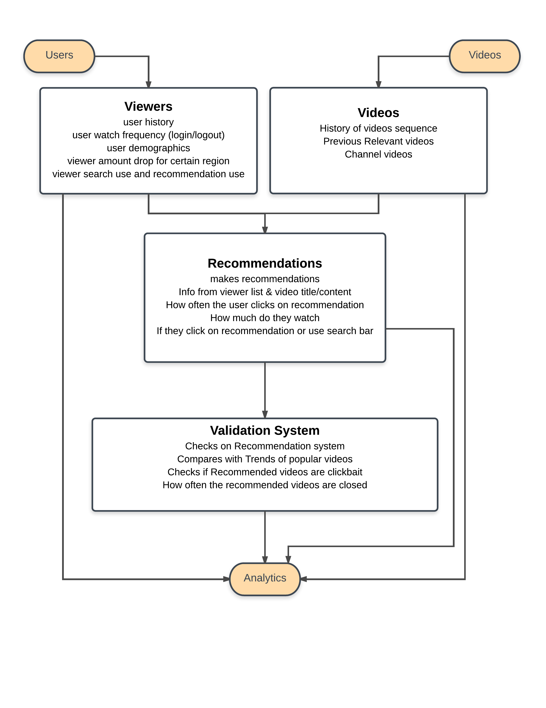
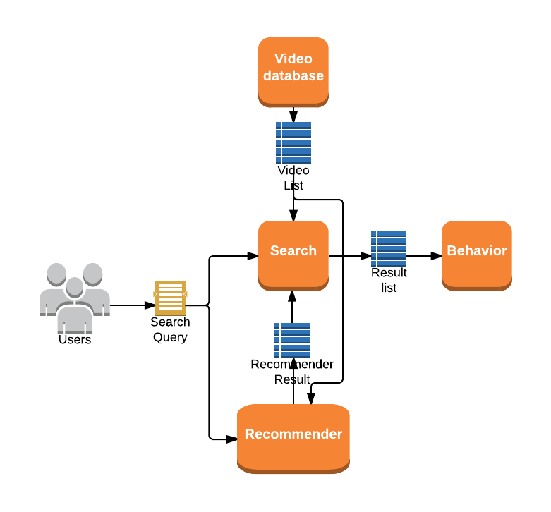
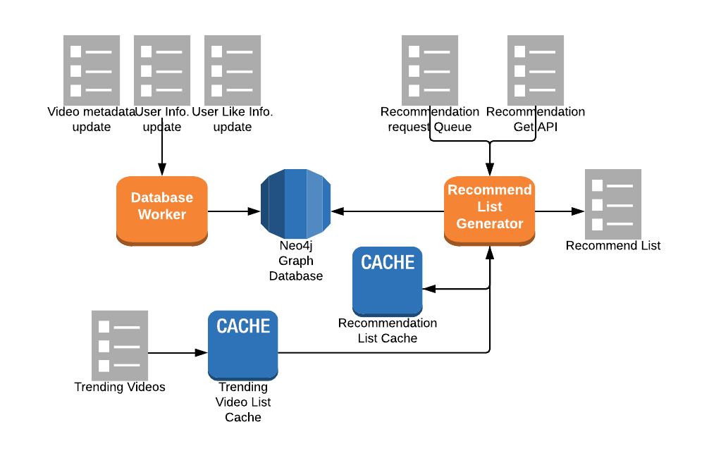
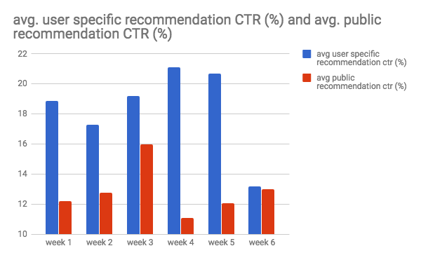
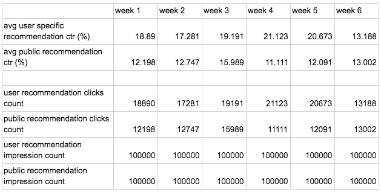

# iRedYou: Recommender Engine

Recommender Engine service for iRecYou project.

## Roadmap

View the project roadmap [here](docs/ROADMAP.md)

## Contributing

See [CONTRIBUTING.md](CONTRIBUTING.md) for contribution guidelines.

# Table of Contents

1. [iRecYou](#iRecYou)
1. [iRecYou Recommender Engine](#iRecYou-Recommender-Engine)
1. [IOCE](#IOCE)
1. [Schema](#Schema)
1. [Requirements](#Requirements)
1. [Sample Analytics output](#Sample-Analytics-output)

## iRecYou
- Simplified clone of YouTube with search and video recommendation functionality
- API:
  - search videos
  - get recommended videos

The object of the project is to build a service that test efficiency of YouTube Recommendation Engine by comparing CTR of recommended videos when they are provided to users.

## iRecYou Recommender Engine
- Simplified clone of YouTube Recommender Engine
- Generates list of recommended videos upon user search query or user selecting a video.

## IOCE
- Input:
  - User Query
  - Selected Video Information
- Output:
  - List of recommended videos

## Schema

## Requirements

- Node 8.5.x
- Redis 4.0.x
- Postgresql 9.6.x
- ElasticSearch 5.6.x
- Logstash 5.6.x

## Sample Analytics output

